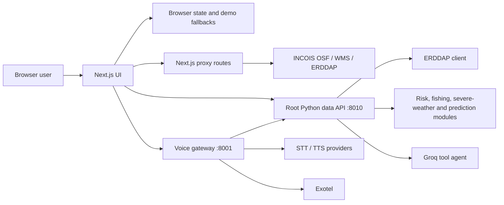
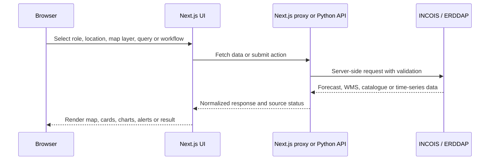
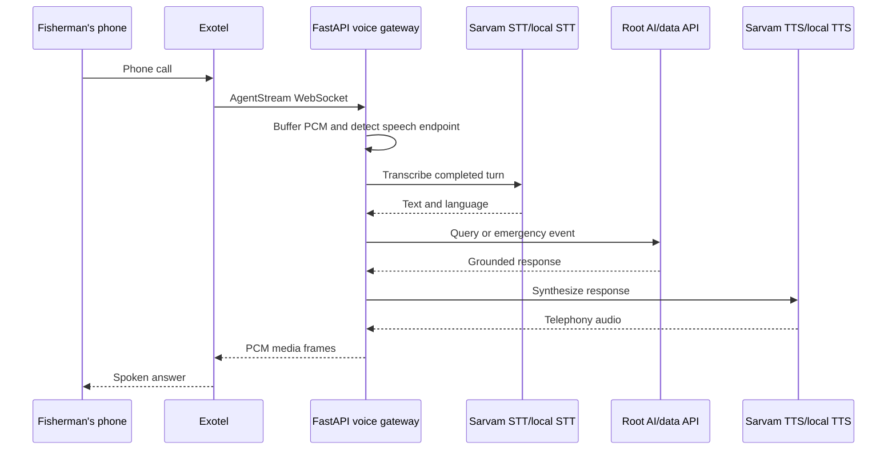

# SALTY

SALTY is a marine-operations console for fishermen, researchers, and coastal
operators. It combines INCOIS ocean data, role-specific workflows, an AI marine
assistant, trip/SAR tooling, and a phone-based voice interface.

The repository is a working prototype: some screens call live services, while
many operational workflows use clearly labelled demo data or browser-local
state when their production API is unavailable.

## Product surfaces

### Web console (`ui2`)

The Next.js application starts at `/`, collects an operational role and phone
number, and opens the role-aware console at `/app`. The active role and selected
location are stored in `localStorage`.

| Role | Implemented surfaces |
| --- | --- |
| Fisherman | Dashboard, fishing zones/PFZ, trip risk and safety, vessel/trip tracking, AI agent, call-agent launch |
| Researcher | Dashboard, INCOIS forecast map, research layers, ERDDAP research console, historical charts/exports, AI research mode |
| Coastal operator | Dashboard, operations map/fleet view, alerts and disasters, SAR/lost-fisherman workflow, INCOIS forecast map, AI agent |

Shared capabilities include location and role switching, hazard alerts, AI
drawer, responsive navigation, saved PFZ zones, operator notifications, and
browser-local journey/SAR records.

Additional route: `/app/geofencing` provides a restricted-zone operator view
with zone selection, proximity-alert controls, and UI actions.

### Marine map

The map page has role-specific views:

- Fishermen see the official INCOIS Ocean State Forecast application through a
  same-origin iframe proxy.
- Researchers can switch between that official forecast and a SALTY research
  map using verified INCOIS WMS layers, map clicks for value inspection, PFZ
  overlays, location, and India boundary layers.
- Operators can switch between an operations/fleet map and the official forecast.

The official INCOIS application supplies its own Leaflet controls, forecast
animation, vectors, legends, WMS layers, and inspection tools. PFZ and
ocean-colour products are not wired as independently controlled official layers
where the required service request has not been verified.

### Voice call agent (`SaltyAI-CallAgent`)

The FastAPI service gives basic phones a regional-language voice interface via
Exotel AgentStream. It supports:

- Bidirectional 8 kHz mono PCM audio over WebSocket.
- Energy/RMS voice activity detection, silence endpointing, barge-in, and
  playback clearing.
- Sarvam Saaras speech-to-text and Sarvam Bulbul text-to-speech clients, with
  local STT/TTS implementations available for development.
- Multilingual/code-mixed language inference and DTMF language selection.
- Bounded multi-turn conversation sessions with location context.
- Layered distress detection: fast lexicon, semantic intent handling, and
  asynchronous forwarding to the main backend emergency endpoint.
- Exotel outbound-call status and call initiation endpoints.

## Architecture



### Web-data flow



### Voice-call flow



## Components and responsibilities

### Next.js console

- `ui2/app` contains landing, role entry, dashboard, map, weather, risk,
  fishing-zone, vessel, research, alerts, geofencing, SAR, and AI pages.
- `ui2/components` contains the application shell, role widgets, maps, charts,
  data badges, AI drawer, call launcher, and workflow views.
- `ui2/lib/marine-context.tsx` owns role, location, local notifications,
  journeys, saved zones, and backend health state.
- `ui2/lib/marine-data.ts` contains the bundled prototype dataset used by
  dashboard cards and fallback workflows.
- `ui2/lib/*-api.ts` contains browser API clients and source-aware fallback
  handling. Results identify `live` versus `demo` data.

### Next.js integration routes

- `GET /api/incois/frame/[...path]`: same-origin proxy for the official OSF
  page and relative resources; works around upstream frame restrictions.
- `GET /api/incois/osf-config`: discovers current OSF dataset filenames from
  the official page.
- `GET /api/incois/wms`: allowlisted server-side WMS proxy for verified
  `ww3/`, `currents/`, and `winds/` datasets.
- `GET /api/erddap/[...path]`: ERDDAP proxy for catalogue and data requests.

### Root Python data API (`api_server.py`)

Runs on port `8010`. Every endpoint that exists:

| Method | Endpoint | Purpose |
| --- | --- | --- |
| GET | `/api/health` | API health |
| GET | `/api/alerts` | INCOIS High Wave and Swell Surge advisories in force |
| GET | `/api/research/catalog` | ERDDAP dataset catalogue |
| GET | `/api/research/timeseries` | ERDDAP time series for a dataset and point |
| GET | `/api/research/frames` | ERDDAP frame list for animation |
| GET | `/api/research/frame.png` | One rendered frame |
| POST | `/api/llm/chat` | Groq tool-calling agent (this is the chat agent) |
| POST | `/api/ai/query` | Same agent, response shape the voice gateway expects |

There is no synthetic or prototype mode. A source that cannot answer returns
`NOT AVAILABLE` and the agent says so; nothing is filled in.

### Data client modules

| Module | Serves | Source |
| --- | --- | --- |
| `thredds_client.py` | waves, swell, period, wind, current, SST | INCOIS Ocean State Forecast (THREDDS NCSS) |
| `pfz_client.py` | PFZ advisories, sector species, EEZ boundary | INCOIS GeoServer WFS |
| `alerts_client.py` | High Wave Alerts, Swell Surge Advisories | INCOIS mobile advisory API |
| `tides_client.py` | high and low water times | Open-Meteo Marine |
| `weather_client.py` | thunderstorms, lightning risk, air weather | Open-Meteo Forecast |
| `ocean_color_client.py` | chlorophyll, SST, SST anomaly and their trend | NOAA CoastWatch ERDDAP |
| `route_client.py` | track check, hazard summary | composed from the above |
| `erddap_client.py` | catalogue and archive queries | INCOIS ERDDAP |
| `prediction_models.py` | the risk score and fishing-window model | no network |
| `groq_agent.py` | the agent: 17 tools, mode voices, honesty guards | Groq |

`ocean_color_client.py` reads NOAA rather than INCOIS for a reason recorded in
its docstring: INCOIS ERDDAP's newest chlorophyll pixel is from 2020 and its
own ocean-colour archive stops in 2006, so it cannot answer "where is the
water productive today".

### Checking the data sources

```bash
python test_sources.py            # every live source, pass/fail with a real value
python test_sources.py --only tides
```

Run it before a demo. It hits the real services, asserts a real value came
back, and never falls back — a source that is down reports FAIL.

### Voice gateway API

- `GET /health`, `/health/live`, `/health/ready`: service and dependency status.
- `GET /exotel/status`: safe Exotel configuration status.
- `POST /exotel/call`: start an outbound Exotel call.
- `WS /ws/exotel/stream` and `WS /ws/voice/stream`: bidirectional voice stream.

The gateway calls the root API through `app/ai/backend_client.py` and forwards
detected emergencies through `app/api/emergency.py`. It is a separate service,
not a module inside the Next.js server.

## Data boundaries

- INCOIS is the source of truth for sea state, PFZ advisories, official
  advisories and the EEZ boundary.
- Tides, thunderstorms and air weather come from Open-Meteo; chlorophyll and
  SST trends come from NOAA CoastWatch. Neither is an INCOIS product, and
  every answer built on them says which source it came from.
- Not available, and the agent must say so rather than improvise: market
  prices; gazetted restricted or no-fishing areas, for which India publishes
  no machine-readable feed; and named-cyclone bulletins, which IMD publishes
  as pages, not as an API.
- `check_route` checks the water along a track. It is not navigation: it knows
  nothing about shoals, traffic, fuel or the boat.

## Run locally

```bash
./run_salty.sh
```

This starts the web console at `http://127.0.0.1:3000`, the root data API at
`http://127.0.0.1:8010`, and attempts to start the voice gateway at
`http://127.0.0.1:8001` when its dependencies are available. The voice gateway
still requires `SaltyAI-CallAgent/.env` configuration for real Exotel/Sarvam
calls.

For live root-API catalog access:

```bash
SALTY_LIVE=1 python3 api_server.py
```

For frontend checks from `ui2`:

```bash
./node_modules/.bin/tsc --noEmit
npm run lint
```

Python phase and voice-agent tests are available as `test_*.py` in the root
and under `SaltyAI-CallAgent/tests`.
